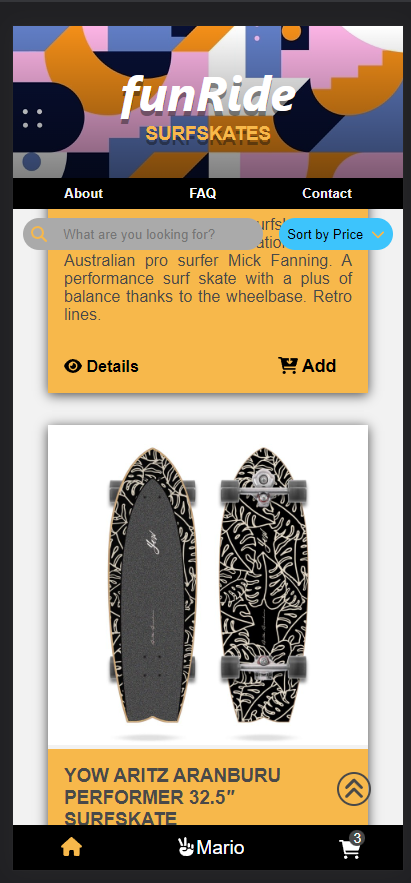

# funRide name

## Description

This application is called 'funRide'. It is a MOBILE FIRST web app used for acquire the best surfskates on the market.
“funRide SURFSKATES is a family driven company based in Catalonia and has built a 
reputation for online selling quality high-performance surfskates.
A good option for surf brands and surf stores to announce and sell their products."



---
## Instructions

When cloning the project, change the <code>sample.env</code> file name for <code>.env</code>. The project will run on **PORT 3000**.

Then, run:
```bash
npm install
```

To start the project run:
```bash
npm run start
```

---
## User stories 

### MVP

- User can sign up and create a new account
- User can login
- User can log out
- User can see product list and its details
- User (admin) can create, edit and delete products

### Backlog

- User can delete his account
- User can filter products by price
- User can search through the searchbar
- User can add and delete products from the Cart

---

## Useful links

- [Presentation slides](https://docs.google.com/presentation/d/1lG9C0JEs70fODM86R0XsyMLSlpFF0aIYjVLaim-VkDI/edit#slide=id.p)
- [Backend repository](https://github.com/FlyerBird/backend-myapp-m3)
- [Frontend repository](https://github.com/FlyerBird/frontend-myapp-m3)
- [Frontend deploy](https://master--funride.netlify.app)


